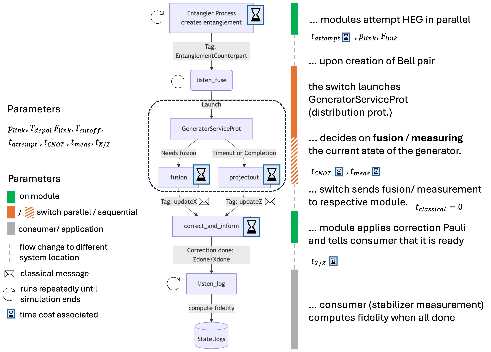

# A quantum entanglement switch protocol for distributed quantum error correction
This code simulates an entanglement switch operating as a  multi-port, short-distance, quantum networking node. In this setup, the switch sits at the center of a distributed quantum computing (DQC) layout and connects to up to $N$ modules, each located at a distance of not more than a few meters. The switch's role is to create link-level Bell pairs with each of the modules and perform our [resource-efficient fusion protocol](https://arxiv.org/pdf/2508.14737) to establish shared multipartite entangled states between modules.

In order to fulfill this role, the setup needs to have the following capabilities: each module needs a communication qubit which is optically interfaced with a corresponding communication qubit at the switch. For each of the $N$ modules, the switch performs heralded entanglement generation over their optical connection **in parallel**. Operationally, all network components are capable of high-fidelity single-qubit Paulis, high-fidelity two-qubit gates `CX`, `CZ` between any pair of local ions.

